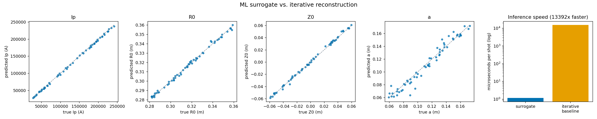

# CUTE Tokamak Magnetic Diagnostic Pipeline

A complete magnetic equilibrium reconstruction pipeline for Columbia University's CUTE (Columbia University Tokamak for Education) spherical torus. Built on the [Open Fusion Toolkit (OFT)](https://github.com/hansec/OpenFUSIONToolkit) TokaMaker Grad-Shafranov solver, this project processes synthetic diagnostic signals, reconstructs plasma equilibria, and provides an interactive dashboard for shot review.

## Quickstart

```bash
# Clone and install
git clone https://github.com/GitLostintheSauce/CUTE_TEST.git
cd CUTE_TEST
python -m venv .venv
source .venv/bin/activate
pip install -e ".[dev]"

# Install OFT (see docs/operator_guide.md for details)
source scripts/setup_env.sh

# Run tests
pytest tests/ -v

# Launch the dashboard
python -m src.dashboard.app --port 8050
```

## Architecture

```
Raw Signals ──► Signal Processing ──► Reconstruction ──► Dashboard
  (HDF5)     (bandpass, notch,      (iterative GS     (Plotly Dash
              drift correction)      solve via OFT)    web app)

┌─────────────────────────────────────────────────────────┐
│                    src/ modules                          │
│                                                         │
│  store/         Signal & shot data I/O (HDF5 + Pydantic)│
│  signal/        Bandpass, notch, integration, calibration│
│  forward/       Sensor geometry + synthetic diagnostics  │
│  reconstruct/   Iterative equilibrium reconstruction     │
│  validation/    Noise sweep, dropout, convergence tests  │
│  dashboard/     Plotly Dash interactive web app          │
└─────────────────────────────────────────────────────────┘
```

**Data flow:** raw HDF5 → `signal.processing.process_pipeline()` → eddy compensation → EFIT reconstruct → `store.hdf5.save_shot()` → `dashboard.app`

### Advanced Reconstruction (v0.2.0)

- **Green's function matrix**: Pre-computed 130×28 matrix relating coil currents to sensor measurements, enabling fast vacuum field decomposition
- **EFIT-style reconstruction**: Iterative decomposition of measured fields into coil + plasma contributions using Tikhonov-regularized least-squares
- **Eddy current compensation**: Exponential decay model of vacuum vessel eddy currents (3 eigenmodes, τ = 30–105 μs), subtracted from measurements before reconstruction
- **Sensor placement optimization**: Fisher information analysis, greedy forward selection, and leave-one-out importance ranking to identify minimum viable sensor sets

See [spec.md](spec.md) for full project specification, phase DAG, and acceptance criteria.

### ML Surrogate Reconstruction (v0.3.0)

A neural-network surrogate that maps the 130 magnetic diagnostic signals
directly to plasma parameters (plasma current, major radius, vertical
position, minor radius), as a fast alternative to iterative reconstruction.

- **From-scratch NumPy MLP** (`src/ml/mlp.py`): forward pass, backprop, Adam,
  and standardization implemented without a deep-learning framework, so the
  feature adds zero heavy dependencies and stays fully reproducible.
- **Physics-grounded training data** (`src/ml/physics.py`, `dataset.py`): a
  reduced forward model built from analytic circular-loop Green's functions
  (elliptic integrals), validated to machine precision against a direct
  Biot-Savart quadrature and the exact on-axis field.
- **Honest benchmark** (`src/ml/baseline.py`): the surrogate is compared
  against a classical nonlinear least-squares inversion of the *same* physics.

Results on a held-out set (`models/surrogate_metrics.json`):

| Metric | Value |
|--------|-------|
| R² (overall) | 0.99 |
| Plasma current MAE | ~1.8 kA (on a 20-250 kA range) |
| Position accuracy (R0, Z0) | ~1 mm |
| Inference speed | ~1 µs/shot |
| Speedup vs. iterative baseline | ~13,000× |

The iterative baseline is slightly more accurate; the surrogate trades a small
accuracy cost for a large speed gain, which is the tradeoff that makes
real-time reconstruction feasible. Train it with:

```bash
python scripts/train_surrogate.py --samples 8000 --epochs 400
```



The dashboard's **ML Surrogate Reconstruction (live)** panel samples a plasma,
adds measurement noise, and reconstructs it on click, showing predicted vs.
true parameters and the inference latency.

## Architecture Details

See [docs/architecture.md](docs/architecture.md) for module responsibilities, design decisions, and data flow diagrams.

## Operator Guide

See [docs/operator_guide.md](docs/operator_guide.md) for how to process shots, use the dashboard, add new sensors, and troubleshoot common issues.

## Project Structure

```
CUTE_TEST/
├── src/
│   ├── store/          # Pydantic schemas + HDF5 I/O
│   ├── signal/         # Signal processing pipeline
│   ├── forward/        # Sensor config + forward model
│   ├── reconstruct/    # Equilibrium reconstruction (constraint + EFIT + eddy)
│   ├── validation/     # Benchmarks, validation, sensor placement
│   └── dashboard/      # Plotly Dash web app
├── tests/              # pytest test suite (76 tests)
├── data/               # CUTE mesh + shot data
├── config/             # Processing parameters (TOML)
├── notebooks/          # Jupyter notebooks
├── docs/               # Documentation
└── spec.md             # Full project specification
```

## Key Dependencies

- **OpenFUSIONToolkit** — Fortran-backed FEM plasma simulation (TokaMaker GS solver)
- **NumPy/SciPy** — Signal processing and numerical computation
- **Pydantic v2** — Data validation schemas
- **HDF5 (h5py)** — Shot data storage
- **Plotly Dash** — Interactive dashboard
- **pytest** — Test framework

## License

This project is part of the CUTE tokamak educational program at Columbia University.
