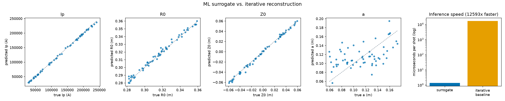
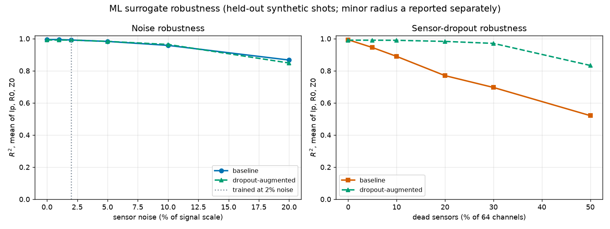
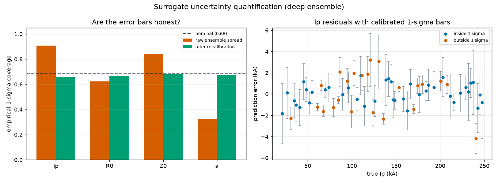

# CUTE Tokamak Magnetic Diagnostic Pipeline


-yellow.svg)


A complete magnetic equilibrium reconstruction pipeline for Columbia University's CUTE (Columbia University Tokamak for Education) spherical torus. Built on the [Open Fusion Toolkit (OFT)](https://github.com/OpenFUSIONToolkit/OpenFUSIONToolkit) TokaMaker Grad-Shafranov solver, this project processes diagnostic signals, reconstructs plasma equilibria, and provides an interactive dashboard for shot review.

**In one sentence:** a tokamak cannot be measured directly, so this pipeline reconstructs the invisible plasma from 64 external magnetic sensors placed where CUTE's real diagnostics are, and includes a from-scratch neural-network surrogate that does that reconstruction roughly 12,000x faster than the classical iterative method.

> Note: the shots shown are synthetic (pipeline-generated) test data. No experimental CUTE data is included, and every panel is labeled accordingly.
> The sensor *positions* are real: `config/cute_diagnostics.json` holds CUTE's
> diagnostic layout (39 flux loops, 25 magnetic probe channels). What those
> sensors read is computed, not measured.

**New to this?** Start with [docs/primer.md](docs/primer.md), a plain-language
walkthrough from "why fusion needs a magnetic bottle" to every result and
caveat here, then the [notebooks](notebooks/README.md) in order.


> Coverage note: the badge reports what CI verifies (55%), where the 48
> solver-dependent tests skip because the Open Fusion Toolkit is not currently
> importable on the runner. With OFT (v26.9) and the optional PyTorch
> extra installed locally, the full suite of 173 tests passes and coverage
> reaches 85%. Why CI cannot run them yet, and what would fix it, is in
> roadmap 1.9 of [ROADMAP.md](ROADMAP.md).



## Run it in one command (Docker)

No Python or solver setup needed:

```bash
docker compose up
# then open http://localhost:8050
```

## Quickstart (local dev)

```bash
# Clone and install
git clone https://github.com/GitLostintheSauce/CUTE_TEST_Fusion.git
cd CUTE_TEST_Fusion

# Requires Python 3.10+ (3.12 recommended). Note: the python3 that ships
# with macOS is 3.9 and its bundled pip is too old for this install; use a
# python.org or Homebrew Python instead (e.g. python3.12 below).
python3.12 -m venv .venv
source .venv/bin/activate
pip install --upgrade pip
pip install -e ".[dev]"
# Optional: the PyTorch surrogate and notebooks/04_surrogate_pytorch.ipynb
pip install -e ".[dev,torch]"

# Generate the synthetic demo shot (used by the dashboard)
python scripts/generate_synthetic_shot.py

# (Optional) train the ML surrogate
python scripts/train_surrogate.py --samples 8000 --epochs 400

# Run tests (solver-dependent tests need OFT v26.9; install steps in docs/operator_guide.md)
pytest tests/ -v

# Launch the dashboard
python -m src.dashboard.app --port 8050
```

## Deploy a public link

The included `Dockerfile` and `render.yaml` make deployment one step:

- **Render.com:** New + -> Blueprint -> point at this repo. Render reads `render.yaml`, builds the Docker image, and gives you a public URL.
- **Hugging Face Spaces:** create a Docker Space and push this repo; it builds the same `Dockerfile`.

The dashboard runs without the OFT solver (viewing shots and the ML surrogate do not need it), which keeps the deployed image small.

## Architecture

```
Raw Signals ──► Signal Processing ──► Reconstruction ──► Dashboard
  (HDF5)     (bandpass, notch,      (iterative GS     (Plotly Dash
              drift correction)      solve via OFT)    web app)

┌─────────────────────────────────────────────────────────┐
│                    src/ modules                          │
│                                                         │
│  store/         Signal & shot data I/O (HDF5 + Pydantic)│
│  signal/        Bandpass, notch, integration, calibration│
│  forward/       Sensor geometry + synthetic diagnostics  │
│  reconstruct/   Iterative equilibrium reconstruction     │
│  validation/    Noise sweep, dropout, convergence tests  │
│  dashboard/     Plotly Dash interactive web app          │
└─────────────────────────────────────────────────────────┘
```

**Data flow:** raw HDF5 → `signal.processing.process_pipeline()` → eddy compensation → EFIT reconstruct → `store.hdf5.save_shot()` → `dashboard.app`

### Advanced Reconstruction (v0.2.0)

- **Green's function matrix**: Pre-computed 64×28 matrix relating coil currents to sensor measurements, enabling fast vacuum field decomposition
- **EFIT-style reconstruction**: Iterative decomposition of measured fields into coil + plasma contributions using Tikhonov-regularized least-squares
- **Eddy current compensation**: Exponential decay model of vacuum vessel eddy currents (3 eigenmodes, τ = 30–105 μs), subtracted from measurements before reconstruction
- **Sensor placement optimization**: Fisher information analysis, greedy forward selection, and leave-one-out importance ranking to identify minimum viable sensor sets

See [spec.md](spec.md) for full project specification, phase DAG, and acceptance criteria.

### ML Surrogate Reconstruction (v0.3.0)

A neural-network surrogate that maps the 64 magnetic diagnostic signals
directly to plasma parameters (plasma current, major radius, vertical
position, minor radius), as a fast alternative to iterative reconstruction.

- **From-scratch NumPy MLP** (`src/ml/mlp.py`): forward pass, backprop, Adam,
  and standardization implemented without a deep-learning framework, so the
  feature adds zero heavy dependencies and stays fully reproducible.
- **PyTorch implementation of the same network** (`src/ml/torch_mlp.py`,
  optional `torch` extra): same architecture, loss, regularization,
  initialization and sensor-dropout rule. From identical weights it matches the
  NumPy model's predictions and training steps to rounding error (about 1e-16),
  and `notebooks/04_surrogate_pytorch.ipynb` reruns the benchmark, dropout and
  calibration studies with it. The NumPy model is kept as the reference.
- **Physics-grounded training data** (`src/forward/filament.py`, `src/ml/dataset.py`): a
  reduced forward model built from analytic circular-loop Green's functions
  (elliptic integrals), validated to machine precision against a direct
  Biot-Savart quadrature and the exact on-axis field.
- **Honest benchmark** (`src/ml/baseline.py`): the surrogate is compared
  against a classical nonlinear least-squares inversion of the *same* physics.

Results on a held-out set of 1,600 synthetic shots at 2% sensor noise
(`models/surrogate_metrics.json`):

| Parameter | R² | Mean abs. error |
|--------|-------|-------|
| Plasma current Ip | 0.999 | 1.9 kA (on a 20-250 kA range) |
| Major radius R0 | 0.986 | 2.1 mm |
| Vertical position Z0 | 0.995 | 1.9 mm |
| Minor radius a | **0.18** | 28 mm (on a 50-180 mm range) |

| Speed | Value |
|--------|-------|
| Inference | ~1.3 µs/shot |
| Speedup vs. iterative baseline | ~12,600× |

**Minor radius is barely measured, and that is the honest result.** In the
reduced model, `a` sets the width of the plasma's current channel. Outside a
round current, the field depends almost only on the total current and where its
center is (the magnetic version of gravity outside a planet). In a ring-shaped
tokamak that rule bends slightly, and a wider current ends up looking from
outside almost exactly like a thin one sitting a little further out. Widening
the channel from 12 to 16 cm is a clearly visible change, but moving R0 out
2.8 mm copies all of it except less than one noise-width. The readings cannot
tell "wider" from "slightly further out", so neither the network nor the
least-squares baseline can pin `a` down; the best any method could do is a
134 mm error, more than its whole range. It is a
simplified version of a textbook limit of magnetic reconstruction: outside
measurements fix the current and position but not how the current is spread
inside.

With the earlier invented sensor layout, `a` scored R² 0.95. That layout put a
flux loop 1.3 cm from the plasma center, inside the current, which no real
machine can do. [Primer Part 10](docs/primer.md#a-worked-example-from-this-project-how-wide-is-the-current)
works through the full argument, and
[notebook 05](notebooks/05_what_the_sensors_can_see.ipynb) shows it in code.
A real reconstruction finds the plasma edge from the whole Grad-Shafranov
equilibrium, which the GS training set (`scripts/generate_gs_dataset.py`) is
the route to.

Where the speedup number comes from (`scripts/train_surrogate.py`): 16.8 ms/shot
for the iterative baseline against 1.33 µs/shot for the surrogate, both measured
in the same run on the same held-out benchmark shots, inference only (training
excluded), on an Apple M1, CPU only, no GPU. Recorded in
`models/surrogate_metrics.json`.

One caveat worth naming, since it flatters the surrogate: the surrogate is timed
as a single vectorized batch and amortized per shot, while the baseline is timed
one shot at a time in a Python loop, because that is how a nonlinear
least-squares inversion actually runs. So the ratio compares batched inference
against sequential fitting, not two implementations tuned equally hard. The
order-of-magnitude conclusion (microseconds vs milliseconds) holds either way,
but ~12,600x is the favorable end of the range, and the absolute times move with
hardware.

Accuracy against the baseline is mixed. On 200 noisy test shots the
least-squares inversion is more accurate on Ip (1.0 vs 2.0 kA mean error) and
Z0 (1.2 vs 1.9 mm); the surrogate is slightly better on R0 (1.9 vs 2.2 mm) and
clearly better on `a` (R² 0.34 vs -0.44). Least squares chases the noise when a
parameter is weakly measured, while the network learns to stay near typical
values. The surrogate trades some accuracy on the well-measured parameters for
a large speed gain, which is the tradeoff that makes real-time reconstruction
feasible. Train it with:

```bash
python scripts/train_surrogate.py --samples 8000 --epochs 400
```


The dashboard's **ML Surrogate Reconstruction (live)** panel samples a plasma,
adds measurement noise, and reconstructs it on click, showing predicted vs.
true parameters and the inference latency.

### Robustness validation

Real diagnostics are noisy and probes fail, so the surrogate is stress-tested
rather than only reported at its best. Full numbers in
[docs/validation_report.md](docs/validation_report.md), regenerated by
`python scripts/validate_surrogate.py`.



**What the study found** (R² below is the mean over Ip, R0 and Z0; `a` is
reported separately in the full report for the reason above):

1. **Noise tolerance is strong.** Accuracy holds at R² 0.96 under 10% sensor
   noise, five times the noise the model was trained on.
2. **Sensor failure was a genuine weakness.** The baseline model degrades
   sharply when channels go dead, because it never saw dead channels in
   training: R² falls from 0.99 to 0.77 with 20% of sensors lost.
3. **Dropout augmentation fixes it.** Retraining with randomly masked input
   channels restores performance under sensor failure:

| 20% of sensors dead | R² (Ip, R0, Z0) | Ip error |
|---|---|---|
| Baseline | 0.77 | 17.9 kA |
| Dropout-augmented | **0.98** | **2.5 kA** |

The cost is small: with every sensor working, the robust model scores R² 0.991
against the baseline's 0.993, and its Ip error is 3.1 kA against 2.0 kA.
Both are shipped, as `models/surrogate.npz` and `models/surrogate_robust.npz`.

### Uncertainty quantification

An operator needs `Ip = 184 kA +/- 3 kA`, not just `184 kA`. A deep ensemble
of 5 networks provides error bars, and the error bars are then checked rather
than assumed. Full detail in
[docs/uncertainty_report.md](docs/uncertainty_report.md), regenerated by
`python scripts/uncertainty_report.py`.



**The finding:** raw ensemble spread is *not* calibrated. For honest 1-sigma
bars the truth should land inside about 68% of the time. It did not, and it
missed in both directions:

| Parameter | 1-sigma coverage (raw) | Verdict |
|---|---|---|
| Ip | 0.91 | too wide (over-cautious) |
| Z0 | 0.84 | too wide |
| R0 | 0.62 | too narrow (overconfident) |
| a | 0.33 | too narrow (overconfident) |

**The fix:** a per-parameter variance rescaling, fitted on a calibration split
that is disjoint from the test split so the result is not circular. Coverage
then lands near nominal (Ip 0.91 to 0.66, `a` 0.33 to 0.67).

After calibration, the error bar on `a` is 37 mm, about the same as the spread
of the whole range `a` is drawn from (38 mm). The ensemble is correctly
reporting that the sensors barely constrain it.

Calibrated error bars appear live in the dashboard's surrogate panel, with
errors exceeding 1 sigma highlighted. The correlation between predicted sigma
and realized error is modest for R0 and Z0 (0.31, 0.37) and near zero for Ip
and `a`, so the bars are right on average but are not a per-shot error
predictor. They are not presented as one.

## Architecture Details

See [docs/architecture.md](docs/architecture.md) for module responsibilities, design decisions, and data flow diagrams.

## Operator Guide

See [docs/operator_guide.md](docs/operator_guide.md) for how to process shots, use the dashboard, add new sensors, and troubleshoot common issues.

## Project Structure

```
CUTE_TEST/
├── src/
│   ├── store/          # Pydantic schemas + HDF5 I/O
│   ├── signal/         # Signal processing pipeline
│   ├── forward/        # Sensor config + forward model
│   ├── reconstruct/    # Equilibrium reconstruction (constraint + EFIT + eddy)
│   ├── validation/     # Benchmarks, validation, sensor placement
│   └── dashboard/      # Plotly Dash web app
├── tests/              # pytest test suite (76 tests)
├── data/               # CUTE mesh + shot data
├── config/             # Processing parameters (TOML)
├── notebooks/          # Jupyter notebooks
├── docs/               # Documentation
└── spec.md             # Full project specification
```

## Key Dependencies

- **OpenFUSIONToolkit**: Fortran-backed FEM plasma simulation (TokaMaker GS solver)
- **NumPy/SciPy**: Signal processing and numerical computation
- **Pydantic v2**: Data validation schemas
- **HDF5 (h5py)**: Shot data storage
- **Plotly Dash**: Interactive dashboard
- **pytest**: Test framework


## License

Released under the [MIT License](LICENSE).
