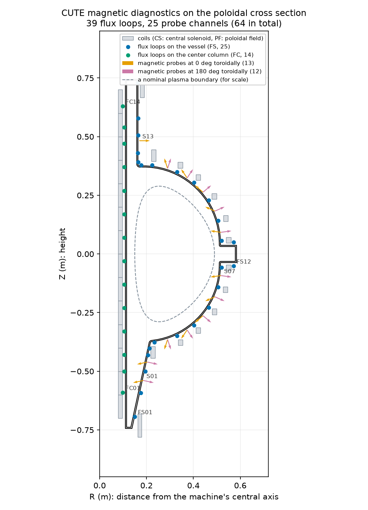

# Background primer

Everything worth knowing to explain this project out loud: how a tokamak works,
what all the symbols mean, what the code actually does, and why each caveat in
the README is there.

Written for someone with no plasma physics background. Roughly an hour to read.

---

## How to read this

Each part is self-contained and ends with a short **recap**. If you drift off,
the recap catches you up, and you can jump straight into the next part.

If you only have twenty minutes, read **Parts 5, 10 and 16**: flux surfaces,
why reconstruction is hard, and the caveats. Everything else supports those.

The order is deliberate. Each part answers a question the previous one raises:

1. Why does fusion need a magnetic bottle?
2. Why does the obvious bottle leak?
3. How does a tokamak fix that?
4. What does CUTE look like?
5. What is psi, and what is a flux surface?
6. What does Grad-Shafranov actually solve?
7. What do q95, beta and li mean?
8. How is a plasma made in the first place?
9. How do you measure something you cannot see?
10. Why is working backwards from those measurements hard?
11. How does reconstruction actually work?
12. Why does speed matter?
13. What is a neural network surrogate?
14. How do you know it works?
15. What is in this repository?
16. What are the caveats and why does each exist?
17. What are OFT, EFIT and TORAX?
18. Glossary
19. Test yourself

---

## Part 1: Why fusion needs a magnetic bottle

Fusion means slamming two light atomic nuclei together hard enough that they
stick, releasing energy. The usual pair is deuterium and tritium, both heavy
versions of hydrogen.

The obstacle is that nuclei are positively charged, and like charges repel. To
get two of them close enough for the strong nuclear force to take over, they
have to be moving fast enough to overcome that repulsion.

"Fast enough," in bulk, means hot. Around **100 million degrees**. Roughly six
times hotter than the centre of the Sun, because the Sun compensates with
crushing gravitational pressure that we cannot reproduce.

At that temperature, atoms have long since lost their electrons. What you have
is a **plasma**: a soup of free nuclei and free electrons, all electrically
charged, behaving less like a gas and more like a fluid that responds violently
to electric and magnetic fields.

Now the practical problem. No material can touch it. Not tungsten, not
anything. Contact would both destroy the wall and instantly quench the plasma,
because the wall is thousands of times colder.

So you need to hold it away from every surface. Three ways exist:

- **Gravity**, which is how stars do it. Not available.
- **Inertia**: compress a tiny pellet so fast it fuses before it can fly apart.
  This is what laser fusion does.
- **Magnetic fields**, which is what a tokamak does.

The magnetic option works because of one convenient fact.

**A charged particle in a magnetic field cannot travel freely across the field
lines, but travels freely along them.**

Specifically it spirals tightly around a field line, like a bead on a wire. The
spiral is small, often under a millimetre. Push the particle sideways and the
magnetic force curves it straight back. But along the wire, nothing stops it.

So a magnetic field is a set of invisible wires that particles are threaded
onto. **Confinement means arranging the wires so they never end at a wall.**

The simplest way to do that: bend the wires into closed loops. A doughnut. A
**torus**.

> **Recap.** Fusion needs a 100-million-degree plasma. Nothing can touch it.
> Charged particles are stuck to magnetic field lines sideways but slide freely
> along them, so if you loop the field lines into a torus, particles circulate
> forever without hitting anything.

---

## Part 2: Why the obvious bottle leaks

Here is where it stops being simple, and this bit is worth following closely
because it explains why tokamaks are shaped the way they are.

Wrap coils around a doughnut-shaped chamber and run current through them, and
you get a magnetic field that runs the long way around the torus. That
direction is called **toroidal**. Field lines are closed loops. Particles
spiral along them forever.

Except it does not work. Two effects break it.

### Problem one: the field is not uniform

The coils are packed closer together on the inside of the doughnut, near the
central hole, than on the outside. So **the field is stronger on the inside and
weaker on the outside**. It falls off roughly as 1/R.

A particle spiralling in a field that varies across its own orbit gets a
slightly tighter curve on the strong-field side than on the weak-field side.
Those unequal arcs do not close into a circle. The orbit's centre creeps
sideways. This is the **grad-B drift**.

### Problem two: the field lines are curved

Field lines going around a torus are curved by definition. A particle following
a curve wants to continue straight, so it feels an outward push, like a
passenger in a turning car. This produces the **curvature drift**.

### Why those two ruin everything

Both drifts push particles **vertically**, up or down.

And here is the fatal part: **they push positive and negative charges in
opposite directions.** Ions drift up, electrons drift down, or the reverse.

So charge separates. Positive collects at the top, negative at the bottom. That
creates an **electric field** pointing vertically through the plasma.

Now combine a vertical electric field with a toroidal magnetic field. Crossed
electric and magnetic fields make charged particles drift in the direction
perpendicular to both, and critically, **this drift is the same direction for
both charges.**

That direction is straight outward, toward the wall.

The whole plasma, ions and electrons together, marches out and hits the vessel.
In milliseconds. A purely toroidal field is not a bottle at all.

### The fix

The trouble came from charge separating between top and bottom. So do not let
top and bottom be separate places.

**Twist the field lines** so that following one takes you from the top of the
plasma to the bottom and back. Now a field line is an electrical short circuit
between the two regions. Charge that starts to build up at the top simply flows
along the field line to the bottom and cancels.

No charge separation, no electric field, no outward drift.

The twist is called **rotational transform**. Every magnetic confinement device
has to produce it somehow. How you produce it is essentially what distinguishes
the machines: a stellarator does it with elaborately shaped external coils, and
a tokamak does it by driving current through the plasma itself.

> **Recap.** A purely toroidal field fails: the field is stronger on the inside
> and the lines are curved, which makes ions and electrons drift in opposite
> vertical directions. The resulting electric field pushes the entire plasma
> into the wall. The fix is to twist the field lines so top and bottom are
> connected and the charge cannot separate.

---

## Part 3: How a tokamak makes the twist

A tokamak drives a large electric current through the plasma itself, going the
long way around the torus.

That current generates its own magnetic field. By the right-hand rule, current
flowing the long way round produces a field that wraps the **short** way round,
the way a field circles a straight wire. The short way round is called
**poloidal**.

Add the two together:

| Component | Source | Direction |
|---|---|---|
| **Toroidal** field | External coils | The long way round |
| **Poloidal** field | The plasma current itself | The short way round |

The sum is a **helix**. Field lines now spiral around the torus like the stripe
on a candy cane, passing through the top and the bottom on each circuit. Exactly
the twist required.

This has a consequence worth sitting with, because it explains why so much of
this project revolves around one number:

**The plasma is not just sitting inside a magnetic bottle. It is generating
half the bottle itself.**

That is why **plasma current, written $I_p$, is the single most important
quantity describing a shot.** It sets the twist, and therefore the confinement.
It is also the first thing your surrogate predicts.

### How you drive current through a gas

You cannot attach wires to a plasma. Instead a tokamak uses a **transformer**.

In an ordinary transformer, changing current in a primary coil induces current
in a secondary. Here the primary is the **central solenoid**, the stack of
coils running up the middle of the doughnut hole. The secondary is the plasma
ring itself.

Ramp current in the central solenoid, its magnetic flux changes, and that
changing flux drives a voltage around the torus, the **loop voltage**. That
voltage first rips the gas apart into plasma, then drives current through it.

There is a catch with real consequences. **A transformer only works while the
flux is changing**, and the solenoid can only be ramped so far before it hits
its current limit. Once you run out of ramp, the loop voltage stops and the
current decays.

That is why conventional tokamaks are **pulsed** rather than continuous, and
why the available "flux swing," measured in volt-seconds, sets the maximum
pulse length. It is exactly what `CUTE_pulse_ex.ipynb` is optimizing when it
maximizes the starting flux: more volt-seconds banked means a longer discharge.

### The other coils

Beyond the toroidal field coils and the central solenoid, a tokamak has
**poloidal field (PF) coils** arranged around the machine. These do the
shaping: pushing the plasma up or down, squashing it, holding it steady.

CUTE has **28 coil sets: 14 central solenoid and 14 poloidal field.**

The PF coils matter more than they sound. A plasma is not passively stable. Squash
it vertically and it becomes prone to drifting up or down and crashing into the
wall, a **vertical displacement event**. Elongated plasmas need active feedback
control to stay put. There is an OFT example about exactly this, `CUTE_VDE_ex`.

> **Recap.** A tokamak twists its field lines by driving current through the
> plasma the long way round, which creates a poloidal field that combines with
> the toroidal field into a helix. The current is driven inductively by a
> central solenoid acting as a transformer primary, which is why tokamaks are
> pulsed. PF coils shape and stabilize the result.

---

## Part 4: The machine, and CUTE in particular

Because a tokamak is (nearly) the same all the way around, you can describe it
entirely in a **2D slice**: a **poloidal cross section**, coordinates $R$
(distance out from the central axis) and $Z$ (height).

Practically every plot in this project is that slice. When you see an oval on a
plot, you are looking at a doughnut cut through and viewed edge-on.

The vocabulary:

- **Major radius $R_0$**: from the machine's central axis to the middle of the
  plasma. **CUTE: about 0.32 m.**
- **Minor radius $a$**: the plasma's own radius. **CUTE: about 0.17 m.**
- **Aspect ratio $R_0/a$**: **about 1.9 for CUTE.**

That aspect ratio is worth pausing on. Conventional tokamaks run around 3 or
higher: a proper doughnut with a clear hole. Anything approaching 2 is a
**spherical tokamak**, which looks less like a doughnut and more like a cored
apple, the hole squeezed down to a narrow column.

Spherical tokamaks tend to confine more plasma pressure for a given magnetic
field, which is efficient, but leave very little room in the centre for the
solenoid and its shielding.

**CUTE is a spherical tokamak, and small.** For comparison, DIII-D has
$R_0 \approx 1.75$ m and runs over 1 MA of plasma current, while CUTE's
operating range here is tens of kiloamps. This is why a DIII-D equilibrium can
only ever be a clearly labeled reference in this project, never a stand-in for
CUTE data. Different size, different shape, different physics regime.

Two shaping numbers you will see constantly:

- **Elongation $\kappa$ (kappa)**: how stretched vertically the cross section
  is. 1.0 is a circle. **CUTE targets about 1.7.** Elongation improves
  performance but brings the vertical instability mentioned above.
- **Triangularity $\delta$ (delta)**: how much the shape is pulled into a D,
  with the flat side facing the central column. **CUTE: about 0.4.** Affects
  edge stability.

> **Recap.** Everything is described in a 2D slice with coordinates R and Z.
> CUTE is a small spherical tokamak: major radius 0.32 m, minor radius 0.17 m,
> aspect ratio about 1.9, elongation about 1.7, triangularity about 0.4.

---

## Part 5: Flux surfaces and psi

**This is the most important part of the primer.** Nearly everything else is
built on this idea, and if you understand it properly the rest gets much
easier.

### The problem it solves

Field lines in a tokamak are helices. Follow one around and it does not
generally come back exactly where it started. Instead it comes back slightly
rotated, then goes round again, slightly rotated again, over and over.

After many circuits, that single field line has traced out an entire **surface**.
Not a line, a surface, wrapped like a coil of thread around a doughnut-shaped
frame.

That surface is a **flux surface**, and it is the natural object to think in.

### The trick: label every point with a number

Define a quantity $\psi(R, Z)$, called the **poloidal magnetic flux**. It
attaches one number to every point in the cross section.

Its defining property is the whole point:

> **Magnetic field lines lie entirely within surfaces of constant $\psi$. They
> never cross from one value of $\psi$ to another.**

So if you know $\psi$ everywhere, you know the shape of every field line, and
therefore the entire magnetic structure of the plasma.

### The map picture

The cleanest way to hold this is as a topographic map.

Imagine a landscape where the height at each point is $\psi$. On a hiking map,
contour lines join points of equal elevation. Here, contour lines join points
of equal $\psi$, and **each contour is a flux surface**.

Follow the analogy through:

- Walking **along** a contour is easy, staying level. That is a particle moving
  along a field line: free, fast.
- Walking **across** contours means climbing. That is a particle crossing flux
  surfaces: slow, difficult, and it happens only through collisions and
  turbulence.

**Confinement is the statement that moving along contours is easy and crossing
them is hard.** Heat and particles leak across slowly, and that leak rate is
what determines whether a reactor works.

### The features you need to name

On this landscape there are specific features with specific names:

**The magnetic axis** is the summit. The innermost flux surface shrinks to a
single point, the hottest densest core.

**The last closed flux surface (LCFS)**, also called the **separatrix**, is the
outermost contour that still closes on itself. Inside it, surfaces are closed
loops and plasma is trapped. Outside it, field lines wander off and eventually
strike the wall.

**This contour is the plasma boundary.** When your dashboard draws the plasma
shape, this is what it is drawing. When the surrogate predicts $R_0$, $Z_0$ and
$a$, it is describing this contour.

**The X-point** is a saddle: a mountain pass where the poloidal field goes to
zero and the separatrix crosses itself in a figure-eight pinch. Machines with
X-points route the escaping plasma into a **divertor**, a purpose-built exhaust
region.

**The limiter** is the older alternative: instead of an X-point, a physical
surface defines the edge, and the boundary is wherever the plasma first touches
it. **For CUTE, the limiter is the inner surface of the vacuum vessel.**

### What a psi map is

A **psi map** is just $\psi$ evaluated across a grid of points. That is the
complete description of an equilibrium. Everything else (boundary shape, safety
factor, stored energy) can be computed from it.

This is why real equilibrium data is stored as psi maps, and why the DIII-D
sample mentioned in the project notes is a "129x129 psi grid."

It is also the source of one of your caveats. **The stored shot files in this
project keep only the boundary contour and some scalar numbers, not a full psi
map.** So the dashboard's flux surfaces are inferred from the boundary shape
rather than solved for, and they are labeled "illustrative" for exactly that
reason. The Grad-Shafranov dataset you generated does now include real psi
maps, which is what unblocks fixing this properly.

> **Recap.** Psi is a number assigned to every point in the cross section, with
> the property that field lines never cross a surface of constant psi. Contours
> of psi are flux surfaces. Particles move freely along them and slowly across
> them, which is confinement. The outermost closed contour is the plasma
> boundary. A psi map is the complete description of an equilibrium.

---

## Part 6: The Grad-Shafranov equation

Now the question: given coils, currents and pressure, **what is psi?**

### The balance

An equilibrium is a standoff. Plasma pressure pushes outward, wanting to
expand. Magnetic forces push inward, containing it. Equilibrium is where they
cancel exactly:

$$\nabla p = \mathbf{J} \times \mathbf{B}$$

In words: the pressure gradient at every point is balanced by the force from
current crossed with magnetic field.

### The equation

Assume axisymmetry, rewrite that balance in terms of $\psi$, and you get the
**Grad-Shafranov equation**:

$$\Delta^* \psi = -\mu_0 R^2 p'(\psi) - F(\psi)F'(\psi)$$

You will never need to manipulate this by hand. You do need to know four things
about it.

**1. Solving it means finding the psi map.** That is the output. Flux surfaces,
boundary shape, magnetic axis, all of it follows.

**2. The right side contains your assumptions.** $p(\psi)$ is the pressure
profile and $F(\psi)$ relates to the toroidal field. These are *inputs*, chosen
by you. In this project they come from `create_power_flux_fun(...)`, which
supplies simple power-law profiles.

This is important and easy to miss: **a Grad-Shafranov solution is only as good
as the profiles you assumed.** The equation does not tell you how pressure is
distributed; you tell it, and it works out the consequences.

**3. It is nonlinear.** The right side depends on $\psi$, the very thing you
are solving for. You cannot solve it in one pass. You guess, compute, correct,
and repeat until it stops changing. That is why `init_psi()` exists: it is the
initial guess. It is also why solving takes time.

**4. Fixed versus free boundary.**

- **Fixed boundary**: you specify the plasma edge and solve inside it. Easier,
  and useful for theory.
- **Free boundary**: the solver determines where the boundary ends up, given
  coil currents and the vessel. Harder, and what real machines require, since
  in reality you control coils, not boundaries.

**TokaMaker is a free-boundary solver.** So is EFIT.

### What it costs

Measured on the CUTE mesh in this project: **about 0.26 seconds per solve**,
with an 0.84 second one-time setup. The mesh has roughly 11,500 cells.

A quarter of a second sounds fast. Hold onto it anyway, because Part 12 is
about why it is far too slow for some purposes.

> **Recap.** Grad-Shafranov expresses the balance between plasma pressure and
> magnetic force for an axisymmetric plasma. Solving it yields the psi map.
> Pressure and current profiles are assumed inputs, not outputs. It is
> nonlinear, so it is solved iteratively. Free boundary means the solver finds
> the plasma edge rather than being told it. One CUTE solve takes about 0.26 s.

---

## Part 7: The numbers everyone quotes

Once you have a psi map you can compute quantities that summarize it. These
appear in `get_stats()` and throughout the project.

### q, the safety factor

Follow a field line. It winds the long way round the torus and the short way
round simultaneously. **$q$ is the number of long-way trips per single
short-way trip.**

If $q = 3$, a field line goes around the torus three times for each time it
goes around the cross section.

The name is not decorative. **Low $q$ means dangerously unstable.** When a field
line closes on itself after a small whole number of circuits, perturbations can
reinforce each other rather than averaging out, which drives magnetic islands
and can end a discharge.

$q$ varies across the plasma, low in the core, higher at the edge.
**$q_{95}$** is its value on the surface enclosing 95% of the flux, near the
boundary. It is quoted constantly because that is where the dangerous
instabilities live. Values of 3 to 5 are typical; below about 2 is asking for
trouble.

### beta, the efficiency

$$\beta = \frac{\text{plasma pressure}}{\text{magnetic pressure}}$$

Magnetic fields are expensive. Beta measures how much plasma you are holding
for the field you spent. Higher is more economical and closer to instability,
so machines run as high as they safely can.

**$\beta_{pol}$** uses the poloidal field specifically, and is the version that
shows up in equilibrium reconstruction because the poloidal field is what the
magnetic diagnostics see.

### li, internal inductance

How **peaked** the current profile is. Is current concentrated in a narrow core
channel, or spread broadly to the edge?

High $l_i$ means peaked. It affects stability and how the plasma responds to
control. It matters here because it is one of the three quantities your
surrogate initially refused to predict.

### Why those three keep coming up in this project

Because of a subtlety you have already dealt with, and it is worth being able
to explain crisply.

In the **reduced analytic model** used to train the original surrogate,
$q_{95}$, $\beta_{pol}$ and $l_i$ are not independently computed. They are
worked out from $I_p$ by formula.

So a network predicting them from sensor signals would not be learning physics.
It would be rediscovering a formula already written in the dataset generator.
Circular, and worthless. Which is why the shipped surrogate predicts only
$I_p$, $R_0$, $Z_0$ and $a$.

With **real Grad-Shafranov equilibria** they become genuinely independent, and
you measured by how much. Over 2000 solved equilibria, $I_p$ explains **42% of
the variance in $q_{95}$, 7% in $\beta_{pol}$, and 6% in $l_i$.** The remainder
is real information that has to be recovered from the magnetics.

The same check disqualified one candidate: stored energy came out at **97%**,
still essentially a restatement of $I_p$, so it stays unpredicted.

That is the difference between assuming a real solver fixed the problem and
checking whether it did.

> **Recap.** q is the field line's twist and q95 near the edge is the stability
> number everyone quotes. Beta is plasma pressure over magnetic pressure, an
> efficiency. li describes how peaked the current profile is. In the reduced
> model all three are formulas of Ip, hence circular; in real GS equilibria
> they carry independent information, measured at 42%, 7% and 6% explained by
> Ip respectively.

---

## Part 8: How a shot actually happens

Useful context, because it explains what `CUTE_null_ex` and `CUTE_pulse_ex` are
doing, and what "time index" means in your dashboard.

A tokamak discharge, a **shot**, has phases:

**1. Vacuum and fill.** Pump the vessel down, admit a small puff of hydrogen or
deuterium.

**2. Breakdown.** Ramp the central solenoid to induce loop voltage. Stray
electrons accelerate, collide with neutral gas, knock loose more electrons, and
an avalanche converts the gas into plasma. This needs a **field null**, a region
where the poloidal field nearly vanishes so newborn electrons stay confined long
enough to multiply rather than immediately striking a wall. That is what
`CUTE_null_ex` assesses.

**3. Current ramp-up.** Keep ramping the solenoid to build $I_p$ from
approximately zero to full value.

**4. Flattop.** Hold roughly steady. This is where experiments happen. In the
example pulse for CUTE, ramp-up and ramp-down are 10 ms each with a 40 ms
flattop between them.

**5. Ramp-down.** Bring the current down deliberately, or the plasma will end
the shot for you.

**A whole CUTE shot lasts tens of milliseconds.** The synthetic shots in this
project span 10 ms sampled at 100 kHz, which gives 1000 samples per channel.

The plasma changes throughout. So an equilibrium is not a property of a shot,
it is a property of **a moment** in a shot. Reconstruction is done at selected
time slices, because each one costs a full solve. Your stored shots keep 5
slices, and the dashboard's "time index" selects among them.

**Flux consumption** is worth knowing as a phrase. Plasma has electrical
resistance, so sustaining current burns volt-seconds continuously. The pulse
ends when the transformer runs out. `CUTE_pulse_ex` models this with a Spitzer
resistivity model, which is the standard formula for how plasma resistance
depends on temperature.

> **Recap.** A shot goes breakdown, ramp-up, flattop, ramp-down, all inside a
> few tens of milliseconds for CUTE. The plasma evolves, so equilibria are
> reconstructed at individual time slices. Sustaining current consumes the
> transformer's volt-seconds, which sets the pulse length.

---

## Part 9: Seeing without seeing

Now the problem your project actually addresses.

You want to know the plasma's shape, position and current. You cannot look
inside. You cannot insert a probe: anything you put in would vaporize and
contaminate the plasma.

Everything must be measured from **outside the vessel**.

Fortunately, the plasma is a large electric current, and electric currents
produce magnetic fields that extend outside them. Measure that field carefully
enough and you can work backwards.

### The two sensor types

**Flux loops** are wire loops encircling the machine toroidally at a fixed
$(R, Z)$. By Faraday's law, changing magnetic flux through a loop induces a
voltage. Integrate that voltage over time and you get **the flux $\psi$ through
that loop**. So a flux loop measures psi directly at a point, which is exactly
the quantity Part 5 was about.

**Magnetic probes** (often called **Mirnov probes**, after the physicist who
used them to study plasma oscillations) are small coils measuring the **local**
magnetic field, not an enclosed flux. A coil responds only to the part of the
field along its own axis. Describe that axis by a unit vector
$(N_R, N_Z)$, an arrow of length 1 in the $R$-$Z$ plane, and the probe reads

$$B_\text{probe} = B_R N_R + B_Z N_Z = B_R\cos\theta + B_Z\sin\theta$$

where $\theta$ is the angle of the arrow. A probe pointing straight out
($\theta = 0$) reads only $B_R$; one pointing straight up
($\theta = 90°$) reads only $B_Z$.

Magnetic probes see the poloidal field directly, which makes them sensitive to
where current is located, and fast enough to catch instabilities.

You will also hear about **Rogowski coils**, which wrap right around the plasma
and measure total current.

### CUTE's sensor set

*Regenerate with `python scripts/plot_sensor_layout.py`. The positions come from
CUTE's diagnostics table, stored in `config/cute_diagnostics.json`.*

**64 channels: 39 flux loops and 25 magnetic probe channels.**

**Flux loops (39).** Two groups, named after where they sit:

- **FS01 to FS25** run around the vacuum vessel, from the bottom (FS01) up the
  lower slope, around the outboard side, and up to the top (FS25).
- **FC01 to FC14** run up the **center column**, in the narrow gap between the
  central solenoid and the vessel's inner wall.

Having loops on both sides of the plasma matters. Moving the plasma outward
brings it closer to the outboard loops and further from the center-column
ones, so *comparing* the two sides is what locates the plasma, much as you
could judge where a lamp stands in a room by how bright each wall is.

**Magnetic probes (13 positions, 25 channels).** S01 to S13 sit around the
vessel, each with its own direction $(N_R, N_Z)$, drawn as arrows in the
figure. The table lists some of them more than once, at different **toroidal
angles** $\phi$: positions the long way around the machine, measured in degrees
from a reference point. `S01@180` means "a probe at S01's $(R, Z)$ position,
but half way around the machine."

Here the 2D assumption from Part 4 has a concrete consequence. If the plasma is
the same all the way around (**axisymmetric**), a probe's reading depends only
on its $(R, Z)$ position and its direction, never on its toroidal angle. That
sorts the table's 32 probe entries into two cases:

1. **Exact repeats are dropped (7 entries).** `S2` and `S13` appear at 0, 90,
   180 and 270 degrees with the same position and direction as `S02` and
   `S13`. In an axisymmetric model all of those read the same number, so they
   add nothing. On the real machine this ring has a job: comparing probes
   around the ring detects when the plasma is *not* the same all the way round
   (a wobble or instability with structure in $\phi$). A 2D model cannot
   represent that, so the ring is out of scope here, not useless.
2. **The `@180` copies of S01 to S12 are kept (12 channels).** Each has the same
   position as its partner but a mirrored direction: $N_R$ flips sign while
   $N_Z$ stays the same. So the pair measures two *different* mixes of $B_R$
   and $B_Z$. Add the two readings and the $B_R$ parts cancel, leaving pure
   $B_Z$; subtract them and you are left with $B_R$. One location, both field
   components.

That gives 13 + 12 = **25 probe channels**. Treat point 2 as an
interpretation, though. It assumes the mirrored direction is a real difference
in how the probes are mounted. If it were only a bookkeeping convention in the
table, each pair would read the same value and there would be 13 independent
probe channels, not 25.

### Checking data before trusting it

A table of 71 sensor entries typed from a PDF is an easy place for a mistake to hide:
a transposed digit, or centimeters read as meters. So before using it, the
positions were checked against something independent, the vacuum vessel's
shape in `config/CUTE_geom.json`, which came from a different source (the
public Open Fusion Toolkit CUTE example).

Every sensor sits about **0.5 cm outside the vessel's outer surface**, which is
exactly where sensors mounted on the vessel should be. A mistyped value would
stand out immediately. Two did look slightly odd: FS22 and FS25 sit 2 to 3 mm
*inside* the 5 mm-thick wall, at $R = 0.162$ m next to neighbours at 0.165 m.
That is either a groove in the wall or rounding in the table, not an error
worth blocking on. `tests/test_forward.py` repeats this check automatically, so
a future edit that breaks the table fails the tests.

The habit is the lesson: **validate a dataset against an independent source
before building on it.**

### What changed, and why it is worth knowing

Earlier versions of this project used an **invented** layout of 130 channels,
a guess made before the real positions were available. Some of those invented
sensors sat *inside the plasma*: one flux loop was 1.3 cm from the plasma
center. Real machines cannot do that; as the start of this part says, anything
put inside would vaporize.

A sensor in the middle of the plasma sees things no real sensor can, and that
made one result look far better than it really is. Part 10 works through
exactly which result, and why.

### One practical wrinkle worth knowing

Both sensor types measure *rates of change*, and are integrated in hardware or
software to give flux and field. Integration accumulates error. A small offset
becomes a **drift** that grows through the shot.

This is one reason real magnetic data is messier than the clean Gaussian noise
model in this project, and it is a concrete example to give if anyone asks what
your noise model leaves out.

> **Recap.** Everything is measured outside the vessel. Flux loops give psi at
> a point; magnetic probes give the field along their own direction. CUTE's
> set is 39 flux loops (on the vessel and the center column) and 25 probe
> channels. In a 2D axisymmetric model, probes that repeat a position and
> direction read the same value and are dropped, while the mirrored `@180`
> probes measure a different field mix and are kept. The positions were checked
> against the vessel shape before use. The signals themselves are still
> synthetic, and real ones drift.

---

## Part 10: Why working backwards is hard

**This is the intellectual core of the project.** Worth reading twice.

### Forward is easy

Given a plasma, compute what each sensor reads. Solve Grad-Shafranov, evaluate
$\psi$ and $\mathbf{B}$ at each sensor position, done. One answer, no ambiguity.

Your notebook does exactly this. `src/forward/model.py` is exactly this.

### Backward is hard

Given 64 sensor readings, what was the plasma?

This is the **inverse problem**, and the difficulty is not merely computational.
It is that **the answer is not unique**.

Different internal current distributions can produce very similar fields
outside the plasma. The external field simply does not carry enough information
to pin down the interior exactly. Rearrange current inside the plasma in the
right compensating way and the outside barely notices.

Mathematically this is called being **ill-posed**: small differences in
measurement can correspond to large differences in the inferred interior.

Add measurement noise and it gets worse. Two genuinely different plasmas can
produce sensor readings that differ by less than your noise floor. No algorithm
can separate them, because the information is not there.

### A worked example from this project: how wide is the current?

This project has a clean, measurable example of "the information is not
there," and it is worth being able to explain in full.

The surrogate predicts four numbers: plasma current $I_p$, major radius $R_0$,
vertical position $Z_0$, and minor radius $a$. With CUTE's real sensors, the
first three come back with $R^2$ of 0.986 or better. The fourth comes back with
$R^2 = 0.18$, barely better than always guessing the average. Why?

**First, what $a$ means here.** The simplified forward model
(`src/ml/dataset.py`, Part 15) treats the plasma as a small disk of current, a central ring plus six rings around it,
all sharing the total current $I_p$. $a$ sets how far out those rings sit. So in
this model, $a$ is really **the width of the current channel**: how spread out
the same total current is.

**The intuition: from outside, a wider current looks like a current further
out.** You may know the gravity version. Outside a planet, gravity depends only
on the planet's total mass and where its center is, not on whether that mass is
packed small or spread wide. Current and magnetic field obey the same kind of
rule (Ampère's law): outside a straight, round wire, the field depends only on
the total current and where the wire is, not on the wire's thickness.

A tokamak's current is bent into a ring rather than straight, so the rule is not
exact. Widening the current does change the outside field, but in a very
particular way: the outer part of the ring, at larger $R$, carries more weight
than the inner part, so a wide current looks from outside almost exactly like a
**thin current sitting slightly further out**. The wider the current, the
larger the apparent shift, roughly in proportion to the width squared.

**The numbers.** Measure every change in **noise units**: divide each sensor's
change by its noise level (2% of its typical signal), then combine all 64. A
size of 1 is about the smallest change you could tell apart from noise; 10 is
easy to see. For a typical plasma ($I_p$ = 150 kA, $R_0$ = 0.32 m, $a$ = 12 cm):

| Change to the plasma | Size of the change | Left after the best imitation by the other three |
|---|---|---|
| $I_p$ up 5% | 22.0 | 18.1 |
| $R_0$ out 1 cm | 33.5 | 1.7 |
| $Z_0$ up 1 cm | 27.1 | 27.1 |
| $a$ from 12 to 16 cm | 8.9 | **0.67** |

Read the first column first. Widening the current by 4 cm is **clearly
visible**, nearly 9 noise-widths. So the signal is not too small; that is the
tempting explanation, and it is wrong.

The second column is the real answer. It asks: how well can the *other three*
parameters fake this change, and what is left over that only this parameter can
explain? For $a$, the best fake is simply "$R_0$ moved out 2.8 mm," and it copies
all but 0.67 noise-widths of the change. What only $a$ can explain is below one
noise-width. The readings cannot tell "wider" from "a little further out."

**So why is $R_0$ recovered well, when the look-alike runs both ways?** The
exchange rate. Four centimetres of $a$ buys only about 3 mm of $R_0$. To fake a
1 cm shift in $R_0$, $a$ would have to change by more than 10 cm, most of its
entire allowed range (5 to 18 cm). So an estimator can only be fooled about
$R_0$ by a few millimetres before the fake runs out of room, while it can be
fooled about $a$ by centimetres. The confusion is shared, but $a$ absorbs it.

**The best any method could do.** The **Cramér-Rao bound** turns this into one
number: given the noise and how the readings depend on each parameter, it is
the smallest error any unbiased method could achieve, network or otherwise.
For $a$ it is **134 mm** with all four parameters unknown, larger than the
whole range. If $R_0$ were known exactly it would be **5.4 mm**. The errors in
$R_0$ and $a$ are correlated at $-0.999$: any mistake in one can be cancelled by
the opposite mistake in the other. Notebook 05 computes all of this.

**Why the old layout hid this.** With the invented layout (Part 9), $a$ scored
$R^2 = 0.95$. The reason was that flux loop 1.3 cm from the plasma center. A
sensor *inside* the current sees the width directly, because how much current
lies inside or outside its position changes as the channel widens, and no
outward shift can fake that. Adding just one such loop to CUTE's real set
brings the best-possible error on $a$ from 134 mm down to 4.9 mm. No real
sensor can sit there. The high score described the invented layout, not CUTE.

**The real-world version of this limit.** Physicists have known this for
decades. For a near-circular plasma, external magnetic measurements determine
$I_p$, the position, and the combination $\beta_{pol} + l_i/2$ (Shafranov's
result), but not $\beta_{pol}$ and $l_i$ separately. $l_i$, the internal
inductance of Part 7, is precisely "how peaked or spread out the current is."
So this project has rediscovered, in simplified form, a textbook limit of
magnetic reconstruction. Real machines get extra help in three ways:

- **Shaping.** Elongated, D-shaped plasmas (Part 4) break the round symmetry, so
  the internal profile leaves a larger fingerprint outside.
- **The boundary is found differently.** A real reconstruction finds the
  plasma edge as the flux surface that touches the wall or passes through an
  X-point, from the whole Grad-Shafranov equilibrium, rather than as the width
  of a rigid current disk. The Grad-Shafranov training set
  (`scripts/generate_gs_dataset.py`) is this project's route to learning that.
- **Internal measurements.** Larger machines add diagnostics that look inside,
  such as motional Stark effect polarimetry, which measures the field direction
  inside the plasma and hence the current profile.

**It is not the network's fault.** The least-squares baseline, which fits the
exact same physics directly, does even worse on $a$ ($R^2 = -0.44$: it chases the
noise). The calibrated error bar on $a$ comes out at 37 mm, about the spread
of the whole range $a$ is drawn from (38 mm). The ensemble is correctly
reporting "I cannot tell." Being able to say *that*, rather than hiding a bad
number, is the point.

### How it is made tractable anyway

You **constrain** the problem. Rather than allowing any conceivable current
distribution, you assume the plasma is in Grad-Shafranov equilibrium and that
its profiles have a particular simple form, then fit the few free parameters to
the measurements.

That is the classical approach and what EFIT does. You are no longer asking
"what current distribution explains this?" but "which member of *this family*
of equilibria best explains this?"

**The assumptions are load-bearing.** A reconstruction is only as trustworthy
as the family it searched within. This is a good thing to be able to say out
loud, because it shows you understand that reconstruction is inference, not
measurement.

> **Recap.** Forward is a direct computation. Backward is ill-posed: different
> internal currents produce nearly identical external fields, so measurements
> alone do not determine the answer. It is made tractable by assuming the
> plasma obeys Grad-Shafranov with simple profiles and fitting a few
> parameters, which means the assumptions carry real weight. This project's
> own example: from sensors outside the vessel, the width of the current
> channel looks almost exactly like a small outward shift (R2 0.18 for minor
> radius a), the simplified version of the textbook limit that outside
> magnetics fix beta_pol + l_i/2 but not the current profile.

---

## Part 11: How reconstruction actually runs

The classical loop, which is what `src/reconstruct/solver.py` implements:

1. **Guess** an equilibrium. Coil currents, profiles, plasma current.
2. **Solve** Grad-Shafranov for that guess. About 0.26 s.
3. **Predict** what each of the 64 sensors would read, using the forward model.
4. **Compare** predicted against measured.
5. **Adjust** the guess to reduce the mismatch.
6. **Repeat** until the mismatch stops shrinking.

Step 5 needs to know which direction to adjust, which requires knowing how each
sensor responds to each coil. That sensitivity matrix, the **Jacobian**, is
built by perturbing each coil in turn and re-solving. With 28 coil sets that is
28 more solves.

Notice the cost structure. **Every iteration contains at least one full
Grad-Shafranov solve**, and building the Jacobian costs many more. A
reconstruction is not 0.26 seconds; it is 0.26 seconds multiplied by a
substantial number of iterations.

A closely related object is the **Green's function matrix** in
`src/reconstruct/greens.py`: solve with unit current in each coil and nothing
else, giving the linear response of every sensor to every coil. Computed once,
reused thereafter.

> **Recap.** Reconstruction guesses, solves, predicts, compares, adjusts, and
> repeats. Each iteration is a full GS solve, and computing the sensitivity
> matrix costs one solve per coil. That multiplication is where the time goes.

---

## Part 12: Why speed matters

Reconstruction taking seconds is fine for analysing a shot afterward. It is
useless for two situations.

### Control

Tokamak plasmas are actively unstable. An elongated plasma will drift
vertically and hit the wall unless a feedback system continuously senses its
position and corrects. Disruptions, where confinement collapses abruptly, can
develop in milliseconds.

**To control something, you must know its state faster than it changes.** A
reconstruction that takes seconds cannot participate in a loop that must act in
milliseconds.

This is precisely why fast reconstruction is interesting to people who work on
control, which is worth knowing given Prof. Paz-Soldan's research is exactly
the control of disruptions and off-normal events.

### Anything that runs the calculation thousands of times

Optimization is the obvious case. "What coil currents give me this shape?"
means trying many configurations. "What is the longest achievable pulse?" means
scanning. The pulse design notebook does exactly this kind of scan.

If one evaluation costs a quarter of a second, a thousand-evaluation search
takes four minutes, and a realistic design study is hours.

**Make the evaluation a microsecond and entirely different workflows become
possible.** Not the same thing faster, but things you would not otherwise
attempt.

That is the argument for a surrogate.

> **Recap.** Slow reconstruction is fine for post-shot analysis and useless for
> real-time control or for anything that must run thousands of times. Speed
> does not just accelerate existing work, it enables work that was previously
> impractical.

---

## Part 13: What a surrogate actually is

No mystery here, and being able to explain it plainly is worth more than
jargon.

### The idea

A **surrogate model** is a fast approximation of a slow computation. You run
the slow thing many times, record inputs and outputs, and fit a function that
reproduces the mapping.

The fitted function knows nothing about physics. It has seen many examples of
"these signals go with this plasma" and interpolates between them.

### The specific setup here

- **Input**: 64 sensor readings.
- **Output**: 4 numbers, $I_p$, $R_0$, $Z_0$, $a$.
- **Model**: a multilayer perceptron, the plainest kind of neural network,
  written from scratch in NumPy in `src/ml/mlp.py`.

A multilayer perceptron is a stack of layers. Each layer multiplies its input
by a matrix of weights, adds an offset, and applies a simple nonlinear function.
Stack a few and you can approximate essentially any smooth mapping, given
enough examples.

**Training** means adjusting the weights to reduce the error between prediction
and truth across the dataset. The error measure is the **loss function**, and
the algorithm that assigns credit backwards through the layers is
**backpropagation**. Adam is the specific update rule used.

### Why this is legitimate rather than a shortcut

The surrogate is not replacing physics. **The physics is in the training data.**
Every example came from a forward-model calculation: here the simplified
filament model, and in the Grad-Shafranov training set a full TokaMaker solve.
The network learns to interpolate between solutions that the physics already
produced.

That framing also tells you the limitation, and it is the one Chris Hansen
pushed on: **the surrogate is only trustworthy where its training data lived.**
Give it a plasma unlike anything it trained on and it will still return four
confident numbers, which may be nonsense.

That is why "where does your equilibria map lie relative to that noise
distribution" is such a sharp question. It is asking whether reality will fall
inside the region where your model has any authority.

### Why robustness is a property of the training data

A related idea worth internalizing, because it sounds like a paradox and is not.

Your surrogate was fragile when sensors were missing: accuracy fell sharply
with 20% of channels dead. The fix was not a cleverer architecture. It was
**training with channels randomly dropped**, so the network learned a mapping
that never relied too heavily on any single sensor.

Robustness was not added to the model. It was added to the **training
distribution**, and the model inherited it. That is exactly Hansen's "think
about the cost function" comment: what the model is robust to is decided by
what you show it and how you score it.

> **Recap.** A surrogate is a fast approximation fitted to examples from the
> slow computation. The physics lives in the training data. It is trustworthy
> only within the region that data covered, and its robustness properties are
> determined by what the training distribution contained.

---

## Part 14: How you know it works

Claiming a model works requires evidence of specific kinds.

### Held-out testing

Never judge a model on data it trained on; it can memorize. Hold some data
back, train on the rest, and evaluate on the held-out portion. That measures
generalization rather than recall.

### R squared

**$R^2$ is the fraction of the variance in the target that the model explains.**
1.0 is perfect, 0 is no better than always guessing the average, and a
negative value means *worse* than always guessing the average.

On held-out data with CUTE's real sensors, the surrogate reaches:

| Parameter | $R^2$ |
|---|---|
| $I_p$ | 0.999 |
| $R_0$ | 0.986 |
| $Z_0$ | 0.995 |
| $a$ | 0.18 |

**Always look at $R^2$ per parameter, not just the average.** Averaged over all
four, this model scores 0.79, which sounds merely mediocre and hides the real
story: three parameters are excellent and one is barely measured at all (Part
10 explains why). The reverse trap is worse. An average of 0.99 can hide one
parameter failing badly if the others are near perfect. The validation report
now shows $a$ in its own column for exactly this reason.

The same statistic is what you used to check whether $q_{95}$ was independent
of $I_p$: an $R^2$ of 0.42 for a straight-line fit on $I_p$ alone means 58% of
$q_{95}$'s behaviour is something else, and therefore worth predicting.

### Error bars, and why they are the interesting part

A prediction without an uncertainty is much less useful. "Ip is 118 kA" invites
a follow-up: how sure?

The method here is a **deep ensemble**: train five networks with different
random initializations and different data ordering. Where they agree, the
answer is well determined. Where they disagree, it is not. **The spread among
them is the uncertainty estimate.**

### Calibration, the part most people skip

Here is the subtle bit, and it is the most scientifically mature thing in the
project.

A raw ensemble spread is not automatically a correct uncertainty. It is just
"how much five networks happened to differ."

The right test is **coverage**. If you claim a one-sigma error bar, then the
truth should fall inside it about **68%** of the time. Not always, and not
rarely. Sixty-eight percent.

You measured it, and it was wrong: coverage was 0.91 for $I_p$ (bars too wide,
overly cautious) and 0.33 for $a$ (bars too narrow, overconfident). The fix was
to fit a per-parameter rescaling on a separate calibration split, after which
all four land between 0.66 and 0.68.

Notice what calibration did to $a$. Its bar had to be widened by a factor of
2.6, to 37 mm, which is about the spread of the whole range $a$ is drawn from.
Calibration cannot create information the sensors do not carry, but it can make
the error bar admit that the information is missing.

This is why occasional red numbers in the dashboard are a **feature**. Red
means the error exceeded the stated one sigma. If that never happened, the bars
would be too wide. Seeing it about a third of the time is the calibration
working correctly.

Being able to explain that fluently is worth a great deal in a conversation
with a physicist, because it demonstrates you understand that an uncertainty
estimate is a claim requiring validation, not a decoration.

> **Recap.** Evaluate on held-out data. R2 is the fraction of variance
> explained: 0.986 or better for Ip, R0 and Z0, only 0.18 for a, so always read
> it per parameter. Error bars come from the spread of a five-model
> ensemble. Raw spread is not automatically calibrated, so coverage was
> measured against the nominal 68%, found wrong, and corrected by rescaling.
> Occasional outside-one-sigma errors are the system working.

---

## Part 15: What is actually in this repository

Two halves that never call each other. Worth being precise, because conflating
them is the easiest mistake to make when describing the project.

### Half one: the TokaMaker pipeline, `src/reconstruct/`

Real Grad-Shafranov work, run from a command line.

| File | Role |
|---|---|
| `cli.py` | The **only** place a TokaMaker object is created. Loads `data/CUTE_mesh.h5`, sets up 28 coil sets, applies bounds and profiles. |
| `solver.py` | The reconstruction loop of Part 11. |
| `greens.py` | Coil-to-sensor response matrix, one solve per coil. |
| `efit.py` | An EFIT-style variant of the same idea. |
| `eddy.py` | Vessel eddy currents, the only file using time-dependent OFT features. |
| `constraints.py` | Field evaluators used by the constraint machinery, and the solver's starting guess for $I_p$ (a one-filament least-squares fit to the probes). |

Plus `src/forward/`, the layer both halves share: `sensors.py` loads CUTE's 64
sensor channels from `config/cute_diagnostics.json`, `model.py` evaluates
$\psi$ and $\mathbf{B}$ at each of them (turning a solved equilibrium into 64
numbers), and `filament.py` holds the analytic magnetics of a circular current
loop, which both halves use.

### Half two: the machine learning, `src/ml/`

| File | Role |
|---|---|
| `dataset.py` | The **reduced** forward model: plasma as a rigid disk of circular current filaments, evaluated analytically with `src/forward/filament.py` (elliptic integrals). Fast, and validated against Biot-Savart, but not a GS solve. |
| `mlp.py` | The from-scratch NumPy network. |
| `baseline.py` | Classical least-squares inversion, the benchmark. |
| `validation.py` | Noise and sensor-dropout studies. |
| `uncertainty.py` | Ensemble, calibration, rescaling. |

### The dashboard, `src/dashboard/`

Reads pre-generated shot files from HDF5. **Contains no solver code at all.**

If asked whether the dashboard runs TokaMaker: **no.** It reads files that were
generated ahead of time, and the generator script is analytic too. TokaMaker
runs in `src/reconstruct/`, through the CLI.

### The newer pieces

- `scripts/generate_gs_dataset.py` drives TokaMaker across randomized plasma
  states, evaluates the 64 diagnostics on each solved equilibrium, and labels
  each sample with the equilibrium's **own measured** parameters.
- `scripts/check_gs_dataset.py` measures whether those labels carry information
  beyond $I_p$, rather than assuming they do.
- `notebooks/01_synthetic_diagnostics.ipynb` walks through the forward map.

### One subtlety in the dataset worth being able to explain

When generating training data you ask the solver for, say, 120 kA, and it
converges to something nearby, perhaps 118.3 kA.

**The label must be 118.3, the achieved value, not 120, the request.**

The reason: the sensors respond to the plasma that actually exists. If you
label with the request, you are asking the network to predict a number its
inputs do not contain. The gap between requested and achieved is solver
convergence behaviour, invisible in the magnetics.

Three specific consequences:

1. **An error floor.** Part of the target is unpredictable noise, so the model
   can never do better than that gap, and you would wrongly conclude it was
   weak.
2. **Learned bias.** If the solver systematically undershoots, the network
   would learn to compensate, encoding solver quirks rather than physics.
3. **Broken calibration.** All ensemble members would see the same corrupted
   labels and agree with each other while all being wrong together. The spread
   would look tight, the true error would be larger, and coverage would fall
   below 68%. Confidently wrong, which is exactly what the calibration work
   exists to prevent.

> **Recap.** The reconstruct half drives TokaMaker; the ML half trains on a
> reduced analytic model; the dashboard reads pre-generated files and runs
> neither. Training labels come from the equilibrium the solver achieved, never
> the one requested.

---

## Part 16: Every caveat, and why it exists

These are the most valuable content in the project. Each marks a place where
overclaiming would have been easy.

**The data is synthetic.** CUTE is not operating. There is no experimental data
anywhere in the repository, and every panel says so. For a machine that is not
yet running, this is not a shortcut. It is the only data that exists, and
building the pipeline before the hardware is the point. Hansen's own framing:
this is useful precisely for machines that have not been built.

**The benchmark is against the same reduced model.** The surrogate is roughly
12,600x faster than a least-squares inversion **of the reduced model it was
trained on**, not faster than Grad-Shafranov. Benchmarking against TokaMaker
would mostly measure reduced physics against full physics, inflating the number
while meaning less. A fair benchmark solves the same problem on the same
physics.

**The surrogate omits q95, beta_pol and li.** Circular in the reduced dataset,
as explained in Part 7. Now measured to be non-circular in the GS dataset.

**Flux contours are labeled illustrative.** Stored shots keep the boundary and
scalars but no psi map, so the contours are inferred from boundary shape rather
than solved.

**Coverage says 52%, not 77%.** OFT does not import on the CI runner, so 48
solver tests skip there. The badge reports what continuous integration can
actually verify, not the nicer local number. A badge that cannot be backed up
costs more credibility than the higher figure buys.

**The sensor positions are real; what they read is not.** The 64 channels sit
where CUTE's diagnostics are (Part 9), but every reading is computed from a
model plasma, never measured. Two interpretation choices sit underneath the
channel count: toroidal repeats are dropped because a 2D model reads them
identically, and the mirrored `@180` probes are treated as genuinely different
mountings (if they are not, there are 13 independent probe channels rather
than 25).

**Minor radius $a$ is barely measured.** $R^2$ 0.18, against 0.986 or better for
the other three. In the reduced model $a$ is the width of the current channel,
which from outside the vessel looks almost exactly like a small outward shift
of the plasma (Part 10). The earlier score of 0.95 came
from an invented sensor sitting inside the plasma. Report the four $R^2$ values
separately, never just their average.

**The full reconstruction is tested against its own solver.**
`scripts/reconstruct_with_oft.py` reconstructs, from CUTE's 64 sensors, an
equilibrium that TokaMaker itself produced, and recovers it to under 1%. That
is weaker than reconstructing someone else's equilibrium or real data, and the
script says so. It also shows that freeing the coil currents lets a fit
converge to the right boundary with the wrong plasma: 45 kA instead of 100 kA.

**The noise model is invented.** 2% independent Gaussian per channel. Real
magnetics drift because signals are integrated, correlate between neighbouring
channels, and occasionally spike. Any error bar is conditional on this
assumption, and replacing it with measured statistics is a priority once data
exists.

**No affiliation is claimed.** You are collaborating, not a member of the CUTE
program, and the repository must not imply otherwise.

Notice the pattern. **Every one of these is a claim you could have made and did
not.** That is what makes the claims you do make believable, and it is the
project's real asset.

---

## Part 17: The tools around you

**Open Fusion Toolkit (OFT)**, and **TokaMaker** inside it. Free-boundary
Grad-Shafranov solver, open source, maintained by Chris Hansen. Ships example
notebooks including several specifically for CUTE: `CUTE_mesh_ex` builds the
mesh, `CUTE_null_ex` assesses breakdown, `CUTE_VDE_ex` studies vertical
displacement, `CUTE_pulse_ex` designs a full pulse.

Worth knowing: **none of those simulates a diagnostic**, and the ITER
reconstruction example uses shape constraints rather than sensor signals. That
gap is what your notebook fills.

**EFIT.** The decades-old standard reconstruction code, Fortran, still widely
used. Its `g-file` format is universal, so reading g-files remains valuable even
though the code itself is dated. TokaMaker is the modern open-source successor,
which is why Hansen would call EFIT outdated.

**TORAX.** Open-source core transport simulator from Google DeepMind, written
in JAX. Where TokaMaker computes the equilibrium at an instant, TORAX evolves
temperature, density and current **through time**. Complementary rather than
competing: TokaMaker supplies geometry, TORAX supplies evolution, and a coupled
example exists in the OFT repository where they pass results back and forth.

Because it is written in JAX it is **differentiable**, meaning you can take
gradients through the whole simulation. That is what makes gradient-based
optimization and control design tractable, and is likely why it came up
alongside optimization.

---

## Part 18: Glossary

| Term | Meaning |
|---|---|
| **Plasma** | Ionized gas of free nuclei and electrons |
| **Toroidal** | The long way around the torus |
| **Poloidal** | The short way around, through the hole and back |
| **$R$, $Z$** | Distance from the central axis, and height |
| **$R_0$, $a$** | Major and minor radius. CUTE: 0.32 m, 0.17 m |
| **Aspect ratio** | $R_0/a$. About 1.9 for CUTE, making it spherical |
| **$\kappa$, $\delta$** | Elongation and triangularity. CUTE: about 1.7 and 0.4 |
| **$I_p$** | Plasma current. The most important single number |
| **$\psi$ (psi)** | Poloidal flux. Contours are flux surfaces |
| **Flux surface** | Surface of constant psi; field lines stay within it |
| **Magnetic axis** | The innermost flux surface, the plasma core |
| **LCFS / separatrix** | Last closed flux surface, the plasma boundary |
| **X-point** | Saddle where poloidal field vanishes and the separatrix crosses |
| **Limiter** | Physical surface defining the edge instead of an X-point |
| **Grad-Shafranov** | The equation whose solution is the psi map |
| **Free boundary** | Solver determines the plasma edge from coil currents |
| **$q_{95}$** | Safety factor near the edge; stability indicator |
| **$\beta_{pol}$** | Plasma pressure over poloidal magnetic pressure |
| **$l_i$** | Internal inductance; how peaked the current profile is |
| **Flux loop** | Loop measuring psi at a point |
| **Magnetic (Mirnov) probe** | Coil measuring the field along its own axis, $B_R N_R + B_Z N_Z$ |
| **Toroidal angle $\phi$** | Position the long way around the machine, in degrees |
| **Axisymmetric** | The same at every toroidal angle; what makes a 2D slice enough |
| **Center column** | The narrow central post holding the solenoid; FC flux loops sit on it |
| **Current channel width** | How spread out the plasma current is; $a$ in the reduced model, related to $l_i$ |
| **Forward problem** | Plasma to sensor readings. Easy |
| **Inverse problem** | Sensor readings to plasma. Ill-posed |
| **Reconstruction** | Solving that inverse problem |
| **Surrogate** | Fast fitted approximation of a slow computation |
| **$R^2$** | Fraction of variance explained; 1.0 is perfect |
| **Coverage** | How often truth falls inside the stated error bar |
| **Calibration** | Correcting error bars so coverage matches the claim |
| **Volt-seconds** | The transformer's budget, setting pulse length |
| **Disruption** | Sudden loss of confinement ending a shot |

---

## Part 19: Test yourself

If these are comfortable, you can hold your end of a conversation.

**Physics**

1. Why does a tokamak need current flowing through the plasma at all?
2. What actually goes wrong with a purely toroidal field?
3. What is a flux surface, and why does it confine anything?
4. What does solving Grad-Shafranov produce, and what did you have to assume?
5. What does $q_{95}$ describe, and why do people care?

**The problem**

6. What is the difference between the forward and inverse problem here?
7. Why is the inverse problem hard, beyond just being slow?
8. Why would fast reconstruction matter to someone working on control?

**Your project**

9. Does the dashboard use TokaMaker?
10. Why is the surrogate benchmarked against least-squares rather than
    TokaMaker?
11. Why did the surrogate refuse to predict $q_{95}$, and what changed?
12. What would break if training labels used the requested plasma current
    rather than the achieved one?
13. Why is it good that some errors in the dashboard show up red?
14. What does your noise model leave out?
15. Why does the surrogate predict $I_p$ and position well but minor radius
    poorly?
16. The diagnostics table lists 32 probe entries. Why does the model use 25?
17. How do you know the sensor positions were typed in correctly?

### Short answers to the ones most likely to be asked

**9.** No. It reads pre-generated HDF5 files and contains no solver code.
TokaMaker runs in `src/reconstruct/` through the CLI.

**10.** Because the surrogate learned the reduced analytic model, and a fair
benchmark solves the same problem on the same physics. Comparing to a full GS
solve would mostly measure reduced physics against full physics.

**11.** In the reduced dataset those quantities are computed from $I_p$ by
formula, so predicting them would be relearning arithmetic. Measured on 2000 GS
equilibria, $I_p$ explains only 42%, 7% and 6% of their variance, so they now
carry real information.

**12.** The network would be asked to predict a number its inputs do not
contain. That sets a floor under its error, risks encoding the solver's
convergence bias, and quietly decalibrates the ensemble error bars.

**13.** Red means the error exceeded the stated one sigma, which should happen
for roughly a third of parameters if the bars are honest. If it never happened,
the bars would be too wide.

**14.** Integrator drift through a shot, correlation between neighbouring
channels, occasional spikes, calibration error, and pickup from changing coil
currents. The model assumes independent Gaussian noise, which is none of those.

**15.** In the reduced model $a$ is the width of the current channel. From
outside, a wider current looks almost exactly like a thin one sitting slightly
further out: widening it by 4 cm is copied by moving $R_0$ out 2.8 mm, leaving
less than one noise-width that only $a$ explains. So the readings cannot tell
the two apart, and $a$ absorbs the confusion because it takes a lot of $a$ to
fake a little $R_0$. It is the simplified version of the known limit that
external magnetics fix $\beta_{pol} + l_i/2$ but not the current profile. The
baseline does worse still, so it is the information, not the network.

**16.** Seven entries repeat another probe's position and direction exactly,
at other toroidal angles. In an axisymmetric model they would read the same
number, so they carry no extra information. On the real machine they detect
non-axisymmetric motion, which a 2D model cannot represent.

**17.** They were checked against the vessel shape from an independent source:
every sensor sits about 0.5 cm outside the vessel, where wall-mounted sensors
belong, and a test repeats that check.
