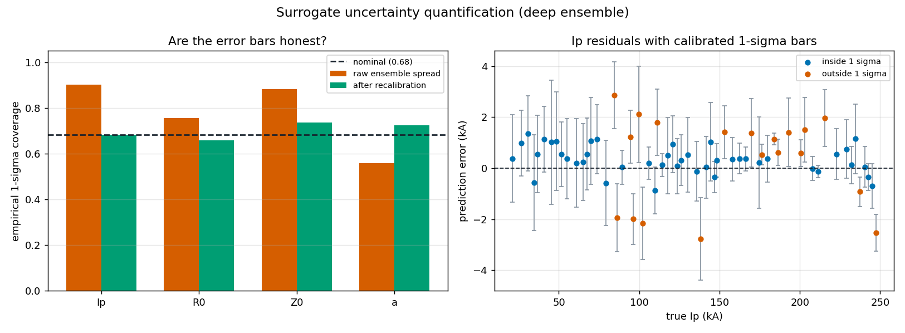

# Surrogate Uncertainty Quantification

A point estimate of `Ip = 184 kA` is far less useful to an operator
than `Ip = 184 kA +/- 3 kA`. This report adds error bars to the
surrogate and, more importantly, checks whether those error bars are
**honest**.

- Method: deep ensemble of **5** networks, each
  trained on its own data draw and random initialization. The spread
  of member predictions is the uncertainty estimate.
- Calibration split: 500 samples (fits the scale factors).
- Test split: 500 samples (reports the numbers below).
  The two are disjoint, so the reported calibration is not circular.

Regenerate with `python scripts/uncertainty_report.py`.

## The finding: raw ensemble spread is not calibrated

For a well-calibrated Gaussian error bar, the true value should fall
within 1 sigma about **68.3%** of the time and within 2 sigma
about **95.4%** of the time. Raw ensemble spread misses this in
both directions: too wide for some parameters, too narrow for others.

| Parameter | 1-sigma coverage (raw) | Verdict |
|---|---|---|
| Ip | 0.902 | too wide (over-cautious) |
| R0 | 0.756 | too wide (over-cautious) |
| Z0 | 0.882 | too wide (over-cautious) |
| a | 0.558 | too narrow (overconfident) |

## The fix: per-parameter variance recalibration

Each parameter's sigma is multiplied by a single scale factor, fitted
on the held-out calibration split as the quantile of
`|error| / sigma` at the target coverage level. This is a standard
nonparametric variance recalibration.

| Parameter | Scale factor | 1-sigma raw | 1-sigma calibrated | target 0.683 |
|---|---|---|---|---|
| Ip | 0.55 | 0.902 | 0.682 | |
| R0 | 0.78 | 0.756 | 0.658 | |
| Z0 | 0.66 | 0.882 | 0.736 | |
| a | 1.51 | 0.558 | 0.724 | |

Scale factors below 1 shrink over-cautious error bars; factors above
1 widen overconfident ones.

## Predicted sigma versus realized error

Coverage alone is not sufficient: a constant error bar can hit the
right coverage while carrying no per-shot information. The
correlation between predicted sigma and realized absolute error shows
whether the estimate actually knows which shots are hard.

| Parameter | corr(sigma, abs error) | Mean sigma (calibrated) | RMSE |
|---|---|---|---|
| Ip | 0.154 | 1153 | 1075 |
| R0 | 0.424 | 0.0008706 | 0.001181 |
| Z0 | 0.369 | 0.0009953 | 0.000979 |
| a | 0.362 | 0.005167 | 0.005848 |

These correlations are positive but modest. The uncertainty estimate
carries real signal about which reconstructions are less reliable, but
it is not a precise per-shot error predictor, and it should not be
presented as one.

## Scope and caveats

- Shots are **synthetic**, from the reduced forward model. These
  numbers describe behaviour on that distribution only.
- Ensemble spread captures uncertainty from training randomness and
  data sampling. It does **not** capture systematic error from the
  reduced forward model itself being an approximation.
- Calibration is fit and reported on disjoint splits, but both come
  from the same generator; calibration on real experimental data would
  need to be refit.
